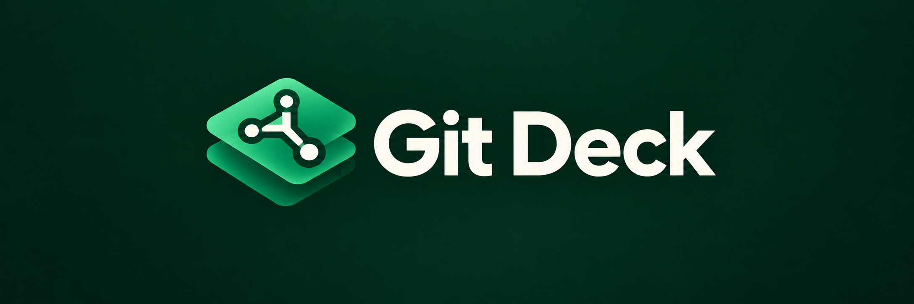

<p align="center">
  
</p>

# Git Deck

A compact, local Git workspace for Windows, created by **Wariddon Rattanamalee**, with development assistance from **OpenAI Codex**.

Git Deck runs a local PowerShell service and opens a browser-based interface. It is an independent project, not affiliated with Sourcetree, Atlassian, GitHub or GitLab.

## Requirements

- Windows with Windows PowerShell 5.1 and Git for Windows available in `PATH`.
- A modern browser. The optional desktop launcher uses Edge/Chrome app mode where available.
- Optional: Git LFS for LFS operations.
- Optional: GitLab CLI (`glab.exe`) in `bin/` for GitLab integration; authenticate using your own account. No third-party CLI binaries or credentials are bundled.
- Optional: GitHub CLI (`gh`) on `PATH` or `bin/gh.exe` for the GitHub tab; run `gh auth login` with your own account.
- Optional: `ANTHROPIC_API_KEY` or a local Ollama model for AI commit message drafts.
- Node.js is needed only for the JavaScript regression test, not to run the app.

## Quick start

```powershell
git clone https://github.com/Wariddon/git-deck.git
cd git-deck
.\git-dashboard.bat
```

Open **http://127.0.0.1:8765/** if the browser does not open automatically. Keep the server running while using the UI.

Use **Clone**, **Add** or **Scan** to register your own repositories. Scan can discover repositories nested inside the chosen folder. Start with a disposable repository to learn the workflow.

The terminal-only menu is available through `git-repo-manager.bat`.

## Optional desktop launcher

```powershell
powershell.exe -NoProfile -ExecutionPolicy Bypass -File .\Build-GitDeck.ps1
.\GitDeck.exe
```

The build uses the Windows .NET Framework C# compiler. Keep the generated executable alongside the scripts and `web/` folder; it is not a standalone bundled application. The executable is unsigned. A server started by the launcher stops by itself about 90 seconds after the last Git Deck window closes (`-IdleShutdownSeconds`); `git-dashboard.bat` keeps running until you close its window.

## Features

- Repository search, scanning, favorites and tabs.
- File status, stage/unstage by file, hunk or individual line, commit and diffs.
- Live refresh: edits, commits and branch switches made in VS Code or a terminal appear automatically.
- One-click **Undo** (or Ctrl+Z) for the last commit, merge, reset, cherry-pick and similar journaled actions.
- Commit message helpers: Conventional Commit type, issue key from the branch name, 72-character subject guide and optional AI drafts.
- Pre-push checks for secrets, large files and direct/force pushes to protected branches.
- Commit history and branch graph; branches, tags, stashes and remotes.
- Fetch, pull and push with a push selection dialog; pull keeps uncommitted work by stashing and restoring it.
- GitLab project and merge-request workflows with optional GitLab CLI.
- GitHub pull requests, Actions runs, PR checkout and PR creation with optional GitHub CLI.
- Themes, resizable panels and saved UI preferences.
- Bounded in-session workspace snapshots and on-demand LFS/submodule checks.

Feature coverage is evolving; this is not a claim of complete Sourcetree or GitLab parity.

## Local data and safety

Repository lists, paths, cached metadata, job output, activity history and saved UI state are generated locally and excluded from Git. Do not distribute your working folder wholesale: it may contain sensitive repository URLs or command output. Share a clean clone instead.

Git credentials come from your own Git/credential-manager configuration. Never place tokens in repository URLs or source files. The server is intended for trusted local use on `127.0.0.1`; do not expose it through a public proxy or tunnel.

Git operations affect real repositories. Review the selected repository, branch and confirmation before pushing, resetting, deleting or discarding. Back up important work. This project has not undergone a complete security audit or broad end-to-end certification.

## Development checks

```powershell
powershell.exe -NoProfile -ExecutionPolicy Bypass -File .\run-tests.ps1
powershell.exe -NoProfile -ExecutionPolicy Bypass -File .\run-tests.ps1 -Filter staging   # only matching files
```

`run-tests.ps1` checks the syntax of every `web/*.js` file and runs every `tests/*.test.cjs` and `tests/*.test.ps1`; CI runs the same script, so a new test file is picked up automatically. The tests are focused regression checks, not a complete end-to-end suite. Restart the local server after backend changes and reload the browser after frontend changes.

## Known limitations

- Up to six recent workspace snapshots persist in this browser for up to seven days, with a size cap. Use Help > Clear workspace cache to remove them. They may contain private repository metadata; do not share your browser profile.
- Read-only requests (status, history, diffs) run in parallel in up to four PowerShell runspaces; Git actions still run one at a time. Start the server with `-Serial` to fall back to one request at a time.
- Cached remote-tracking information is not proof of current remote state; Fetch explicitly when needed.
- GitLab integration needs a separately installed and authenticated CLI in `bin/glab.exe`.

## Credits and licensing

Creator: Wariddon Rattanamalee. Development assistance: OpenAI Codex.

Licensed under the MIT License; see LICENSE.

## Staging lines, Undo and shortcuts

In **File Status**, click `+`/`−` lines in a hunk (Shift+click selects a range) and choose **Stage lines**, **Unstage lines** or **Discard lines**. Git applies only the selected lines.

**Undo** appears next to Push right after a journaled action (commit, merge, reset, cherry-pick, branch switch…). Undoing a commit uses `git reset --soft`, so its changes return to the staging area. Other actions restore the previous HEAD, which needs a clean working tree. Undo is offered only while HEAD still matches the state right after that action, so newer work is never overwritten.

Keyboard shortcuts (outside text fields): `J`/`K` next/previous file or commit, `S`/`U` stage/unstage the selected file, `C` commit message, `/` search, `R` refresh, `F` fetch, `Shift+P` push, `Ctrl+Z` undo, `?` shortcut list.

## Appearance

The theme menu also sets the **Look** and **Text size**, stored per browser:

- **Clean** (default) uses fewer borders and hides repeated hints. File Status sorting and layout sit under **View**, History order and layout join its **View ▾** menu, and rarely used diff tools move under **⋯**, and change/file navigation becomes arrows. The Ctrl+Enter hint lives in the commit message placeholder. The toolbar keeps Commit, Fetch, Pull, Push and More (Branch and Tag sit at the top of More). The repository list folds Create / Add / Scan into **＋ Add**, shows counts on the filter chips instead of the summary tiles, and hides an empty Scan locations card. **Classic** is the original dense layout, unchanged.
- **Text size** 8 / 10 / 12 / 14 px (default 12) scales all UI copy. Diff text keeps its own A− / A+ size.


The theme menu has a **Language** switch (English / ไทย), stored per browser. Source copy is English; `web/i18n.js` looks each string up with `t('English text', {placeholders})` and falls back to English when there is no translation. Thai strings live in `web/i18n-th.js`, and `tests/i18n.test.cjs` fails when a `t()` key has no Thai entry, when an entry is no longer used, or when placeholders differ. Migration is gradual: the GitHub tab, line staging, commit helpers, pre-push checks, pull, undo and shortcuts are translated; the main workspace (`app.js`, `diff-ui.js`, `release-ui.js`, `workflow-ui.js`) is still English-only.

## Pulling with uncommitted changes

**Pull** no longer requires a clean working tree. Before pulling, Git Deck lists your changed files that the incoming commits also touch, then runs `git pull --autostash` after you confirm: your changes are stashed, the pull runs, and they are restored. If restoring conflicts, File Status opens with the conflicted files and a copy of your changes stays in the stash (`autostash`) until you drop it. Untracked files are not stashed, so a pull that would overwrite one is blocked up front. Predictions use the last Fetch.

## Pre-push checks

The Push dialog scans the commits that the remote does not have yet: added lines that look like private keys or API tokens (AWS, GitHub, GitLab, Slack, Anthropic, Google and generic `password = "…"` assignments), files of 5 MB or more, sensitive file names such as `.env` or `*.pem`, and direct or force pushes to `main`, `master`, `develop`, `release/*` and similar branches. Blocking findings ask for confirmation before pushing. Previews are masked, and the scan runs locally only. It is a safety net, not a replacement for server-side secret scanning.

## AI commit messages (optional)

**✨ Suggest** in the commit box drafts a message from the *staged* diff. Nothing is sent until you click it and confirm, and the diff is never sent if it contains something that looks like a secret. Diffs over 120 KB are cut, and the UI says so.

- Anthropic: set the `ANTHROPIC_API_KEY` environment variable, then restart Git Deck. The default model is `claude-opus-5-5`.
- Local model: create `git-deck-ai.json` next to the server (it is git-ignored):

```json
{ "provider": "ollama", "ollamaModel": "llama3.1", "ollamaUrl": "http://127.0.0.1:11434", "language": "Thai" }
```

`GITDECK_AI_PROVIDER` and `GITDECK_AI_MODEL` override the file. Always review the draft before committing.

## GitHub

For repositories whose `origin` is on github.com, the **GitHub** tab lists open pull requests and recent Actions runs. From there you can open or check out a PR, re-run failed jobs, and push the current branch and create a pull request. It uses your own `gh auth login` session. Git Deck never stores GitHub tokens.

## Daily workflow helpers

Open **Help** (under **View & tools**) or press **Ctrl+K** and search:

- **Before sending**: fresh local branch/working-file review, explicit remote/target comparison, and an optional online GitLab MR status check. The Push dialog still requires its own destination selection and confirmation.
- **Refresh files**: also runs when returning to the app from an IDE. Reads only the active repo's status; it does not Fetch or reload History. External HEAD changes show a refresh notice.
- **Action help**: explains common Push/Checkout/Merge blockers and links to File Status, Remotes, Conflict Center and Compare.
- **Worksets**: save up to 30 named groups of up to 50 open repo tabs. Opening a group preserves existing tabs/drafts; missing repositories are skipped, never cloned automatically. Groups are stored locally in this browser.
- **Performance**: bounded, numeric-only local timings. Request time includes network/queue/server work; the difference from Git time is not an exact queue measurement. Render measures synchronous DOM work. Copying a report never uploads it.
- **Practice**: creates a new repository in `sandboxes/practice-*`, with local practice identity and no remote. Stage/commit `notes.txt`, then merge `lesson/conflict` into `main` to practice conflict resolution. Existing practice repositories are never overwritten or automatically deleted.

Checkout now opens a fresh comparison and blocks confirmation while working changes or an operation are pending. It does not automatically stash. Git is checked again immediately before checkout.

Restart the local server after updating: the new status, checkout-review and practice endpoints require the matching server version. This workflow does not require online access except explicit remote/MR actions.

## Commit diff reader

Commit inspection remembers the selected file, file filter and diff scroll position per repository and commit (up to 20 recent commits per repository, stored in this browser). Missing files fall back to a file that still exists. Rapid repository switching uses a latest-request guard when restoring the view; restoring an already-selected commit does not request its details again.

Commit details show file status and added/removed line counts; per-file History/Blame live in the overflow menu. Blame explicitly reads the current working revision. Merge details compare against the first parent.

The diff reader remembers font size (12px default), supports unified/side-by-side layouts, independent scrolling, wrap, intraline highlights, non-filtering search, previous/next change, collapsed context, and focus mode with previous/next file. Escape exits focus mode.

Preview reads the selected commit, or its first parent for a deleted file. Markdown uses a restricted text-only subset: no executable HTML, external images or active links. PDF/binary files offer a download rather than an embedded viewer. Content is capped at 10 MB, text previews at 1 MB, and displayed diffs at 6,000 lines/500 KB. Search covers loaded diff content only. Restart the local server after updating to enable the content endpoint.

## Install with Scoop or winget

After publishing a GitHub release with the ZIP from `Build-Release.ps1`, generate package manifests that point at it:

```powershell
.\Build-Release.ps1 -Version 1.2.0
# upload dist\GitDeck-1.2.0-windows.zip to the GitHub release v1.2.0
.\packaging\New-PackageManifests.ps1 -Version 1.2.0
```

This writes `dist\packaging\git-deck.json` (a Scoop bucket manifest with `checkver`/`autoupdate` and persisted local data) and `dist\packaging\winget\<version>\` (a portable-zip winget manifest). Run `winget validate` and a local install test on Windows before submitting to a Scoop bucket or `microsoft/winget-pkgs`.

## Portable release and support

Run `powershell.exe -NoProfile -ExecutionPolicy Bypass -File .\Build-Release.ps1` to build a ZIP and SHA-256 checksum in `dist/`. Extract the whole ZIP to a writable folder before opening `GitDeck.exe`. Git for Windows is still required; the launcher is unsigned.

Help includes a readiness check and a privacy-safe diagnostic report. Reports contain only allowlisted version/readiness fields, not raw error output. Nothing is uploaded automatically. First launch offers the readiness check.

Push now requires a review of local tracking-ref comparisons. It does not contact the remote until you explicitly Fetch or Push. A missing remote-tracking branch does not prove the remote branch is absent.

The Windows GitHub Actions workflow runs focused tests and builds a downloadable artifact. It does not publish GitHub Releases automatically. Run `node tests/release-tools.test.cjs` and `powershell.exe -NoProfile -ExecutionPolicy Bypass -File tests/release-server.test.ps1` for the additional local checks.
